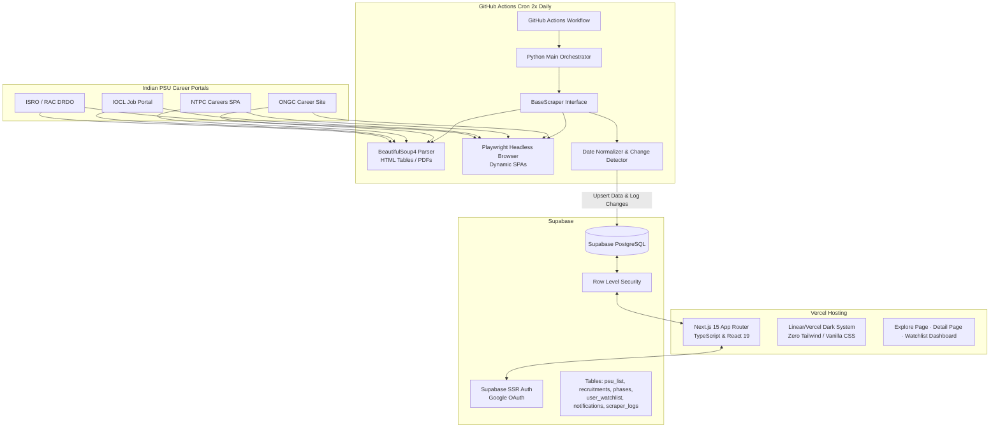

# ⚡ PSUTrack — Unified PSU Recruitment Tracking Portal

> **Stop checking 30 clutter-heavy government job sites every week.**  
> **PSUTrack** continuously monitors 50+ Indian Public Sector Undertakings (Maharatnas, Navratnas, Banks, Defence & Research labs), tracking recruitment progress phase-by-phase with real-time alerts, branch-wise post breakdowns, and salary/perks intelligence.

---

## 🌟 Overview & Value Proposition

In India, PSU job notifications (via GATE or direct exams) are scattered across dozens of antiquated government career portals. Existing aggregator sites like SarkariResult or FreeJobAlert are ad-heavy, noisy, and operate like basic notice boards without tracking recruitment lifecycles or branch eligibility.

**PSUTrack solves this by providing:**
- **Phase-by-Phase Stepper Tracking**: Follow every recruitment through 7 distinct phases — from *Notification Out* to *Application Window*, *Admit Card*, *Exam Date*, *Result*, and *Final Joining*.
- **Branch-Specific Eligibility Filtering**: Instantly filter notices relevant to Electrical, Mechanical, CSE/IT, Civil, Chemical, Mining, Aerospace, or Finance/HR.
- **Pay Scale & Perks Intelligence**: Real-world CTC ranges, monthly in-hand estimates, service bond requirements, and township/perk breakdowns crowd-sourced from PSU alumni and community data.
- **Automated 2× Daily Scraping Engine**: Headless scrapers run automatically at 8:00 AM & 8:00 PM IST via GitHub Actions to detect phase changes and new notices without manual intervention.

---

## 🏗️ End-to-End System Architecture & Data Flow



---

## 🔄 Detailed Data & Lifecycle Flow

1. **Scheduled Trigger (8:00 AM & 8:00 PM IST)**:
   - A GitHub Actions cron workflow (`.github/workflows/scrape.yml`) spins up an Ubuntu container with Python 3.12 and Playwright Chromium.

2. **Scraping & Normalization**:
   - The orchestrator (`scraper/main.py`) runs modular scrapers inherited from `BaseScraper`.
   - HTML/DOM content is fetched via `httpx` or Playwright. Messy Indian date strings (e.g. `15th Aug, 2025` or `30.09.2025`) are normalized to ISO `YYYY-MM-DD`.

3. **Change Detection & Database Sync**:
   - `change_detector.py` compares freshly scraped recruitment states against existing records in Supabase.
   - If a recruitment advances (e.g. from `application_open` to `admit_card`), a `PHASE_CHANGE` event is registered and logged in `scraper_logs`.

4. **Frontend Delivery**:
   - Next.js 15 server & client components render the latest recruitment pipelines dynamically.
   - Users can filter by discipline, view vacancy breakdowns by post, explore pay scales/bonds, and add PSUs to their personal watchlist synced with Supabase Auth.

---

## 🛠️ Technology Stack

| Layer | Technologies |
|---|---|
| **Frontend Framework** | Next.js 15 (App Router), React 19, TypeScript |
| **Styling & Theme** | Custom Vanilla CSS Design System (Linear / Vercel dark aesthetic `#09090B`) |
| **Database & Auth** | Supabase (PostgreSQL, Row Level Security, Supabase SSR Auth) |
| **Scraper Engine** | Python 3.12, BeautifulSoup4, Playwright, PyMuPDF, `dateutil` |
| **Automation** | GitHub Actions Workflows (Cron schedule) |
| **Deployment** | Vercel (Frontend), Supabase (Database & Auth) |

---

## 🗄️ Database Schema Overview

```sql
-- PSU List Registry
psu_list (id, slug, name, full_name, category, sector, career_url, logo_emoji, brand_color)

-- Recruitment Announcements
recruitments (id, psu_id, title, post_name, total_vacancies, qualifications, gate_based, source_url, current_phase)

-- 7-Phase Stepper Timeline
phases (id, recruitment_id, phase_name, phase_status, start_date, end_date, source_link)

-- User Watchlist
user_watchlist (user_id, psu_id, notify_email, added_at)

-- Scraper Health Logs
scraper_logs (id, psu_id, run_at, status, items_found, items_changed, error_message)
```

---

## 🚀 Getting Started Locally

### Prerequisites
- Node.js 18+ & npm
- Python 3.12+ (for running scrapers locally)
- Supabase project credentials

### 1. Clone & Install Dependencies
```bash
git clone https://github.com/divas7/psutrack.git
cd psutrack

# Install Next.js dependencies
npm install
```

### 2. Set Up Environment Variables
Create a `.env.local` file in the root directory:
```env
NEXT_PUBLIC_SUPABASE_URL=https://your-project.supabase.co
NEXT_PUBLIC_SUPABASE_ANON_KEY=your-anon-key
SUPABASE_SERVICE_ROLE_KEY=your-service-role-key
```

### 3. Run the Local Development Server
```bash
npm run dev
```
Open [http://localhost:3000](http://localhost:3000) in your browser.

---

## 🕷️ Running the Scraper Locally

```bash
# Navigate & install Python requirements
pip install -r scraper/requirements.txt
playwright install chromium

# Run scrapers in dry-run mode (no DB writes)
python -m scraper.main --dry-run

# Run a specific PSU scraper (e.g., ONGC)
python -m scraper.main --psu ongc
```

---

## 📄 License

Built for PSU aspirants across India. Released under the [MIT License](LICENSE).
